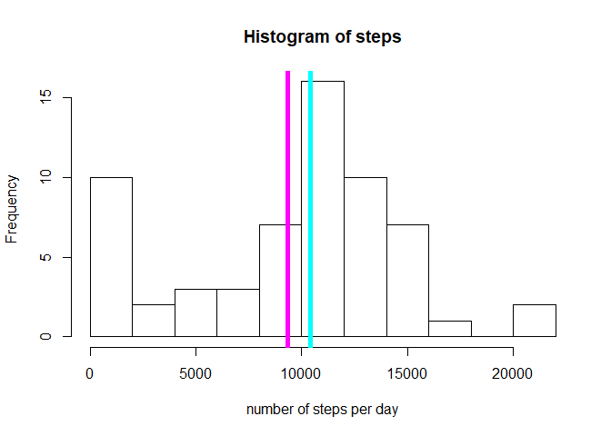
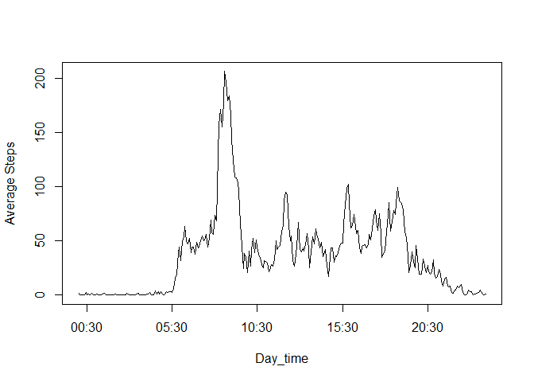
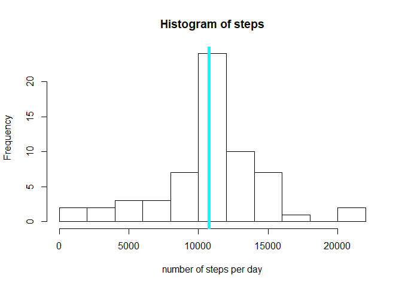
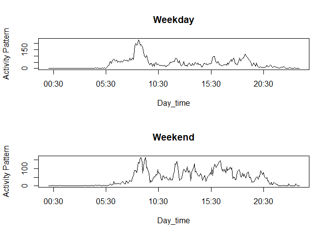

## Loading and preprocessing the data
In the first part of the assignment, the dataframe from should be imported into R in a reproducible manner. unzip function for extraction of zip files is used inside read.csv function and the result is a csv. 
For processing of following parts of the assignment, date and interval should change to POSIXct, POSIXlt. It has been done through sprintf and strptime functions.

```r
library(dplyr)
```

```
## 
## Attaching package: 'dplyr'
```

```
## The following objects are masked from 'package:stats':
## 
##     filter, lag
```

```
## The following objects are masked from 'package:base':
## 
##     intersect, setdiff, setequal, union
```

```r
library(lubridate)
```

```
## 
## Attaching package: 'lubridate'
```

```
## The following object is masked from 'package:base':
## 
##     date
```

```r
activity <- read.csv(unzip("activity.zip"))
activity$date <- as.Date(activity$date, "%Y-%m-%d")
activity$real_time<- sprintf("%04d", activity$interval)
activity$real_time <- strptime(activity$real_time, format = "%H%M")
```
## What is mean total number of steps taken per day?
this requirement can be accomplshied in many different ways, I used dplyr package here to chain the functions and take the mean of grouped dataframe. there are NANs in the dataframe that has been neglected.

```r
Sum_Act <- activity %>% group_by(date) %>% 
             summarise(steps = sum(steps, na.rm = TRUE))
hist(Sum_Act$steps, breaks=10, 
     xlab="number of steps per day", 
     main="Histogram of steps")
print(mean(Sum_Act$steps))
```

```
## [1] 9354.23
```

```r
print(median(Sum_Act$steps))
```

```
## [1] 10395
```

```r
abline(v=mean(Sum_Act$steps) , col="magenta", lwd =5)
abline(v=median(Sum_Act$steps), col="cyan", lwd=5)
```

<!-- -->

## What is the average daily activity pattern?
This part of assignment needs to compute the average of steps per intervals. Thus, same intervals in various days should be grouped together and the average be calculated on all of them. Just for fun I used tapply for applying a function on a grouped dataframe here.

```r
avg_steps <- tapply(activity$steps, activity$interval, mean, na.rm=TRUE)
plot((unique(activity$real_time)), avg_steps, type ='l',
      xlab="Day_time",
      ylab='Average Steps')
```

<!-- -->

```r
max_interval <- which(avg_steps == max(avg_steps))
sprintf('%2d:%2d', as.integer(names(max_interval))%/%100, as.integer(names(max_interval))%%100)
```

```
## [1] " 8:35"
```

## Imputing missing values
Missing values are in the steps column. I used the mean of each interval across all days to impute the missing values.

```r
Missing <- is.na(activity)
sum(Missing)
```

```
## [1] 2304
```

```r
imputed <- transform(activity, steps=ifelse(is.na(steps), avg_steps, steps))

Sum_Act <- imputed %>% group_by(date) %>% 
             summarise(steps = sum(steps, na.rm = TRUE))

hist(Sum_Act$steps, breaks=10, 
     xlab="number of steps per day", 
     main="Histogram of steps")
print(mean(Sum_Act$steps))
```

```
## [1] 10766.19
```

```r
print(median(Sum_Act$steps))
```

```
## [1] 10766.19
```

```r
abline(v=mean(Sum_Act$steps) , col="magenta", lwd =5)
abline(v=median(Sum_Act$steps), col="cyan", lwd=5)
```

<!-- -->

```r
sum(activity$steps, na.rm=TRUE)
```

```
## [1] 570608
```

```r
sum(imputed$steps)
```

```
## [1] 656737.5
```

## Are there differences in activity patterns between weekdays and weekends?
For separating weekdays and weekends, I used a factor variable with Saturday and Sunday as weekend and aggregated the dataframe using this new variable into a new column. Plotting for weekdays and weekends shows different patterns of number of steps.

```r
week_factor <-  factor(weekdays(imputed$date) %in% c("Saturday","Sunday"), 
             labels=c("weekday","weekend"), ordered=FALSE)

week_sec <- aggregate(imputed$steps, by=list(interval=imputed$interval, weekday=week_factor), mean)

par(mfrow = c(2,1))

plot((unique(activity$real_time)),week_sec[week_sec$weekday=='weekday','x'],
     type = 'l',
     xlab="Day_time",
     ylab='Activity Pattern',
     main='Weekday')
plot((unique(activity$real_time)),week_sec[week_sec$weekday=='weekend','x'],
     type = 'l',
     xlab="Day_time",
     ylab='Activity Pattern',
     main='Weekend')
```

<!-- -->
